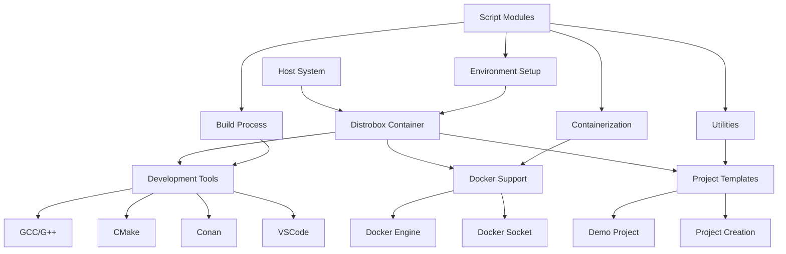
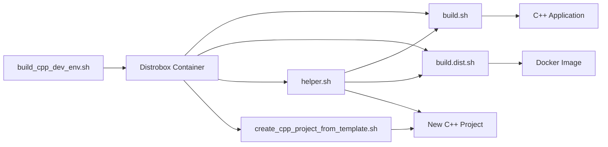

# System Patterns: C++ Development Environment Setup

## System Architecture

The C++ Development Environment Setup project follows a modular architecture with distinct components that work together to provide a complete development environment:



The architecture consists of the following key components:

1. **Host System**: The user's base operating system where Distrobox and Docker are installed.
2. **Distrobox Container**: An Ubuntu 22.04 container that provides the isolated development environment.
3. **Development Tools**: Essential tools for C++ development installed within the container.
4. **Docker Support**: Integration with Docker for containerizing applications.
5. **Project Templates**: Templates and automation for creating and managing C++ projects.
6. **Script Modules**: Shell scripts that automate various aspects of the development workflow.

## Key Technical Decisions

1. **Use of Distrobox**:
   - Provides container-based isolation without requiring a full virtual machine
   - Allows seamless integration with the host system's graphical applications
   - Enables mounting of host directories for easy file access
   - Supports running Docker within the container

2. **Ubuntu 22.04 as Base Image**:
   - Provides a stable, well-supported base for development
   - Has good compatibility with modern C++ development tools
   - Widely used in production environments, ensuring similarity between development and deployment

3. **CMake + Conan for Build System**:
   - CMake provides a modern, cross-platform build system
   - Conan offers dependency management specifically designed for C++
   - The combination allows for reproducible builds with proper dependency resolution

4. **VSCode Integration**:
   - Provides a modern, extensible IDE for C++ development
   - Supports debugging, IntelliSense, and other essential features
   - Can be easily configured through JSON files for consistent setup

5. **Docker-in-Docker Approach**:
   - Allows building and testing Docker containers within the development environment
   - Enables a complete development-to-deployment workflow within the container
   - Implemented by mounting the host's Docker socket into the container

## Design Patterns in Use

1. **Command Pattern**:
   - Each script encapsulates a specific command or set of commands
   - Scripts provide a consistent interface for executing complex operations
   - Parameters allow customization of command behavior

2. **Template Method Pattern**:
   - The project creation script defines a template for new projects
   - Specific parts of the template can be customized during project creation
   - The overall structure remains consistent across all created projects

3. **Facade Pattern**:
   - Scripts provide a simplified interface to complex subsystems
   - Users don't need to understand the underlying details to use the system
   - Complex operations are encapsulated behind simple commands

4. **Builder Pattern**:
   - The build.dist.sh script acts as a builder for Docker images
   - It handles the step-by-step process of creating a properly configured Docker image
   - The process is customizable through configuration files

5. **Configuration Object Pattern**:
   - Configuration is externalized in .dist_build and .env_dist files
   - These files define parameters that control the behavior of the scripts
   - Changes to configuration don't require modifying the scripts themselves

## Component Relationships



The relationships between components are as follows:

1. **build_cpp_dev_env.sh** creates and configures the Distrobox container.
2. **build.sh** compiles the C++ application within the container.
3. **build.dist.sh** creates a Docker image from the compiled application.
4. **helper.sh** provides utility functions for the other scripts.
5. **create_cpp_project_from_template.sh** creates new C++ projects from templates.

## Critical Implementation Paths

1. **Environment Setup Path**:
   ```
   Check Prerequisites → Install Missing Tools → Create Container → Configure Container → Install Development Tools → Set Up Project
   ```

2. **Build Process Path**:
   ```
   Generate Conan Files → Configure CMake → Build Application → Output Binary
   ```

3. **Containerization Path**:
   ```
   Process Configuration → Build Application → Detect Dependencies → Generate Dockerfile → Build Docker Image → Tag Image
   ```

4. **Project Creation Path**:
   ```
   Validate Parameters → Create Project Directory → Copy Template Files → Replace Template Names → Process launch.json → Configure Project
   ```

5. **launch.json Processing Path**:
   ```
   Find launch.json → Comment Existing Program Lines → Add Project-Specific Program Line → Add ${BIN_NAME} Line → Clean Duplicate Entries → Preserve Template Lines
   ```

These critical paths represent the main workflows that the system supports and are implemented through the various scripts in the project.
